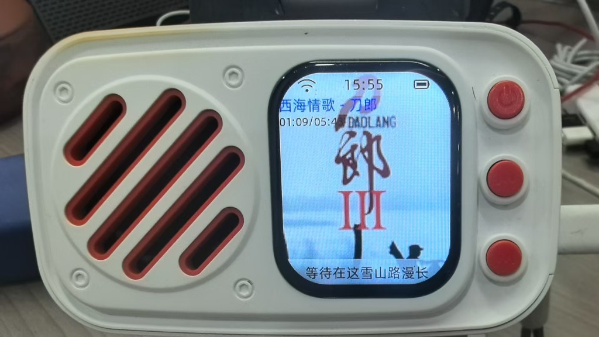

# xiaozhi-esp32

基于 [小智 AI 聊天机器人（xiaozhi-esp32）](https://github.com/78/xiaozhi-esp32) 源码扩展的 ESP32 固件工程，在保留小智语音对话能力的基础上，集成 **IOTSdk 在线音乐播放** 能力（咪咕音乐内容源）。

## 上游项目

本工程源码基于上游仓库 **[78/xiaozhi-esp32](https://github.com/78/xiaozhi-esp32)** 的 **`v2.2.6`** 分支开发。

| 项目 | 说明 |
|------|------|
| 上游仓库 | https://github.com/78/xiaozhi-esp32 |
| 基准分支 | [v2.2.6](https://github.com/78/xiaozhi-esp32/tree/v2.2.6) |
| 上游许可证 | MIT License |

上游项目提供 MCP 语音交互、多板型支持、WebSocket/MQTT 通信等基础能力；本工程在此基础上增加在线音乐模块，并接入速启科技 IOTSdk。

## 在线音乐扩展说明

> 开源项目默认只能搜索 5 首「流行」歌曲，如需开通完整业务，请与商务联系。

本工程通过 **`components/iotsdk`** 组件集成预编译库 `migumusic.a`，对外暴露两类核心接口：

| 模块 | 头文件 | 文档 | 职责 |
|------|--------|------|------|
| **IOTSdk** | `components/iotsdk/IOTSdk.h` | [IOTSdk.md](components/iotsdk/docs/IOTSdk.md) | 设备鉴权、咪咕/OpenAPI 请求、搜歌、歌曲信息查询、播放上报等 |
| **IMusicPlayer** | `components/iotsdk/IMusicPlayer.h` | [IMusicPlayer.md](components/iotsdk/docs/IMusicPlayer.md) | 在线搜歌、拉流解码、PCM 输出、暂停/续播、封面/歌词/进度回调 |

### 集成架构（摘要）

```text
设备激活完成
    ↓
IOTSdk::SetOnGetBoardHttp()   // 4G 板卡必选；WiFi 板卡通常省略（见 IOTSdk.md）
    ↓
IOTSdk::Init(workspace, args) // 鉴权参数见下文「IOTSdk 初始化」
    ↓
IMusicPlayer::Init()          // 播放器配置
    ↓
Esp32Music（main/boards/common/esp32_music.cc）
    ├─ Search / Play / Pause / Resume / Next / Previous
    ├─ 封面 → Display::SetPreviewImage
    ├─ 歌名 → Display::SetMusicTitle
    ├─ 进度/歌词 → Display::SetMusicProgress
    └─ PCM → AudioCodec 输出
    ↓
MCP 工具（main/mcp_server.cc）
    self.music.play_online / stop / pause / resume / next / prev / get_queue
```

### 主要能力

- **语音/云端控制播歌**：通过 MCP 工具 `self.music.play_online` 等触发在线搜索与播放
- **咪咕音乐内容**：搜索、试听拉流、封面显示、歌词与播放进度展示
- **暂停/续播**：`Pause()` / `Resume()` 保留播放列表与进度，可从中断处继续（见 [IMusicPlayer.md](components/iotsdk/docs/IMusicPlayer.md)）
- **与对话共存**：播放时抢占 TTS/上行通道；连接云端或 TTS 播报时自动 `Pause()` 打断音乐（见 `Esp32Music`）；曲目正常播完可自动切下一首

### 运行效果

> 开源项目默认只能搜索 5 首「流行」歌曲，如需开通完整业务，请与商务联系。

在线播放咪咕音乐时的设备界面示例：顶部状态栏显示网络与时间，中部展示歌曲封面，下方显示歌名/歌手、播放进度（`01:09/05:43`）与当前歌词。

<a href="components/iotsdk/docs/music-player-demo.png" target="_blank" title="在线音乐播放运行效果">
  
</a>

更完整的 API 说明、回调约定、编译依赖与集成检查清单，请参阅：

- [components/iotsdk/docs/IOTSdk.md](components/iotsdk/docs/IOTSdk.md)
- [components/iotsdk/docs/IMusicPlayer.md](components/iotsdk/docs/IMusicPlayer.md)

## 开发环境

| 工具 | 版本要求 |
|------|----------|
| **ESP-IDF** | **v5.5.2**（必须） |
| 编辑器 | Cursor / VSCode + ESP-IDF 插件 |
| 目标芯片 | ESP32-S3 / ESP32-C3 等（依板型配置） |

> 请使用 ESP-IDF **5.5.2** 工具链编译本工程，其他版本可能存在组件或 API 不兼容问题。

### 编译

```bash
# 安装并导出 ESP-IDF v5.5.2 环境后
idf.py set-target esp32s3   # 按实际板型选择
idf.py build
idf.py flash monitor
```

### 编译注意事项

- 工程 `main` 依赖 `iotsdk` 组件（预编译 `migumusic.a`）
- 需在 `sdkconfig` 中启用 **`CONFIG_MBEDTLS_DES_C=y`**（IOTSdk 加解密依赖 DES；`sdkconfig.defaults.*` 已包含示例配置）
- 托管组件需包含 `espressif/esp_audio_codec`、`espressif/esp_audio_effects` 等（见 `main/idf_component.yml`）

## IOTSdk 初始化

设备完成激活后，会在 `main/application.cc` 中初始化 IOTSdk。初始化参数为 JSON 字符串，**各字段值须向速启科技申请**，请勿使用空字符串上线。

**板载 HTTP（`SetOnGetBoardHttp`）：**

| 模组类型 | 是否注册 | 说明 |
|----------|----------|------|
| **4G** | **必须** | 须在 `Init()` 之前注册，否则无法使用网络功能 |
| **WiFi** | **不建议** | 省略该回调更省内存、性能更优（详见 [IOTSdk.md](components/iotsdk/docs/IOTSdk.md) 第 4.2 节） |

4G 板卡示例（须在 `Init` 之前调用；`BoardHttp` 实现参考 `components/iotsdk/EspBoard.cpp`）：

```cpp
IOTSdk::Singleton().SetOnGetBoardHttp([](int action) -> std::unique_ptr<BoardHttp> {
    return std::make_unique<BoardHttpImpl>();
});

cJSON* root = cJSON_CreateObject();
cJSON_AddStringToObject(root, "deviceId", "");           // 设备唯一标识（必填）
cJSON_AddStringToObject(root, "appLicenseId", "");       // 许可证 ID（必填）
cJSON_AddStringToObject(root, "appKey", "");             // App Key（必填）
cJSON_AddStringToObject(root, "serverToken", "");        // 服务端 Token（必填）
cJSON_AddStringToObject(root, "regionCode", "");         // 区域编码（必填）
cJSON_AddStringToObject(root, "servicePackageCode", ""); // 服务套餐码（必填）
cJSON_AddStringToObject(root, "env", "test");            // 环境：test（测试）/ prod（生产）
char* args = cJSON_PrintUnformatted(root);
IOTSdk::Singleton().Init("./", args);
cJSON_free(args);
cJSON_Delete(root);
```

| 字段 | 必填 | 说明 |
|------|------|------|
| `deviceId` | 是 | 设备唯一标识 |
| `appLicenseId` | 是 | 许可证 ID |
| `appKey` | 是 | 应用 Key |
| `serverToken` | 是 | 服务端 Token |
| `regionCode` | 是 | 区域编码 |
| `servicePackageCode` | 是 | 服务套餐码 |
| `env` | 否 | `test` 测试环境，`prod` 生产环境 |

**请在编译/烧录前，将向速启科技申请到的参数填入上述 JSON 字段。** 未配置有效参数时，IOTSdk 初始化及在线音乐功能将无法正常工作。

## 目录结构（与本扩展相关）

```text
components/iotsdk/
├── migumusic.a          # IOTSdk + IMusicPlayer 预编译库
├── IOTSdk.h             # SDK 接口
├── IMusicPlayer.h       # 播放器接口
├── EspBoard.cpp         # 板载 HTTP/MQTT 适配（由 main 引用）
└── docs/
    ├── IOTSdk.md
    ├── IMusicPlayer.md
    └── music-player-demo.png  # 在线音乐播放运行效果截图

main/boards/common/
├── esp32_music.h/.cc    # 板级音乐封装，对接 IMusicPlayer 与 Display/Audio
└── music.h              # Music 抽象接口

main/mcp_server.cc       # self.music.* MCP 工具注册
main/application.cc      # IOTSdk 初始化入口
```

## MCP 音乐工具

| 工具名 | 说明 |
|--------|------|
| `self.music.play_online` | 在线搜歌并播放（`text` 必填） |
| `self.music.stop` | 停止播放并退出音乐模式（清空队列） |
| `self.music.pause` | 暂停当前曲目（保留列表与进度） |
| `self.music.resume` | 从暂停处继续播放 |
| `self.music.next` | 下一首 |
| `self.music.prev` | 上一首 |
| `self.music.get_queue` | 获取当前播放队列（JSON） |
| `self.music.set_play_mode` | 占位接口，当前未实现 |

## 许可证

- 基于 [xiaozhi-esp32 v2.2.6](https://github.com/78/xiaozhi-esp32/tree/v2.2.6) 修改的部分遵循上游 **MIT License**，详见 [LICENSE](LICENSE)。
- `components/iotsdk/migumusic.a` 为预编译二进制库，其使用与分发须遵守速启科技/IOTSdk 相关授权约定，**不等同于 MIT 开源源码**。

## 联系我们

商务合作与SDK获取请联系：

[lz@suqi.tech](mailto:lz@suqi.tech)  
[zhouwanguang@suqi.tech](mailto:zhouwanguang@suqi.tech)

<a href="components/iotsdk/docs/contacts.png" target="_blank" title="企业微信">
    
</a>